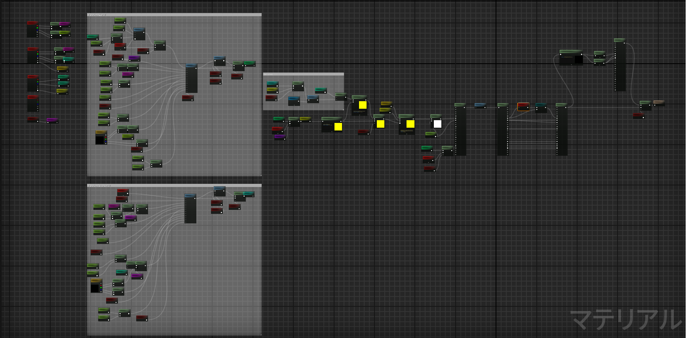
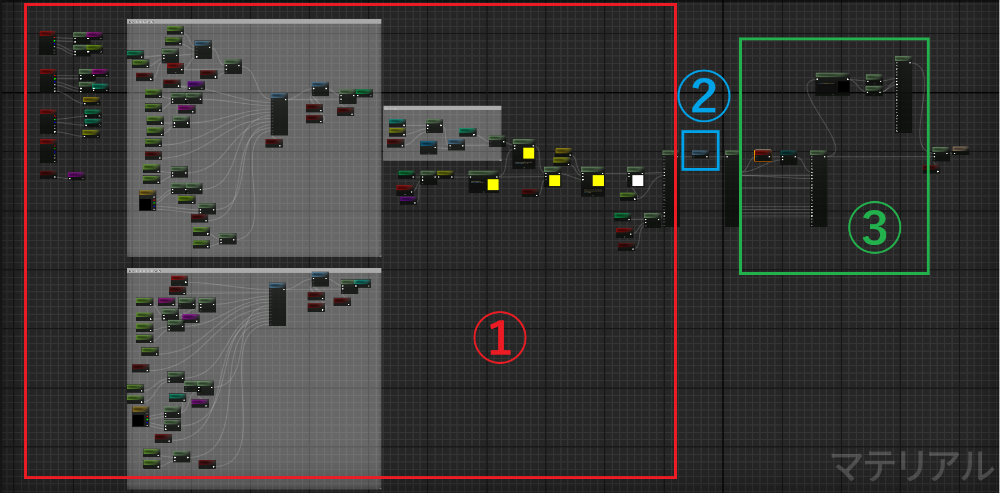
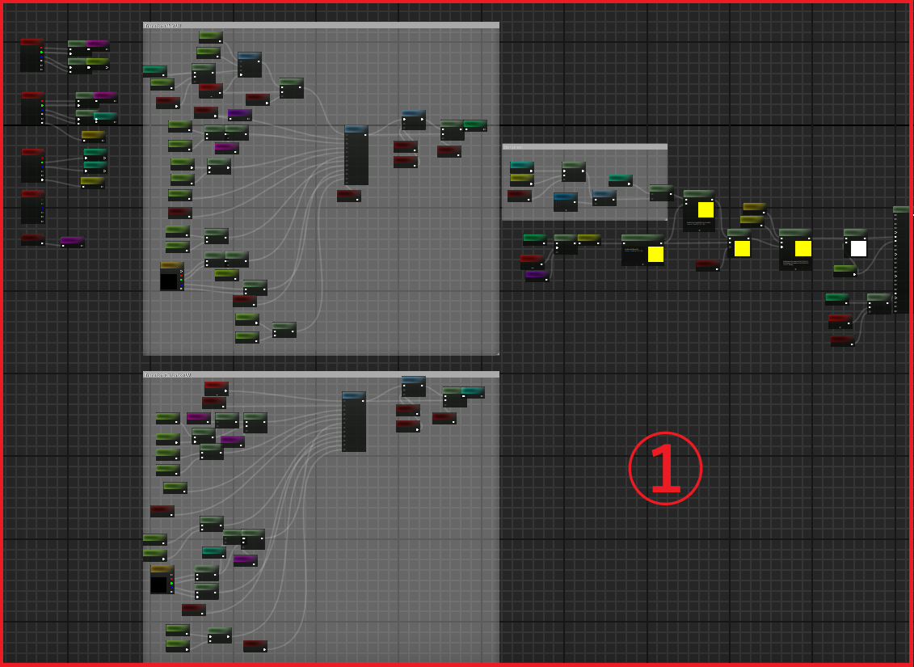
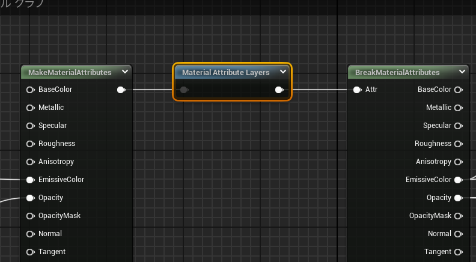
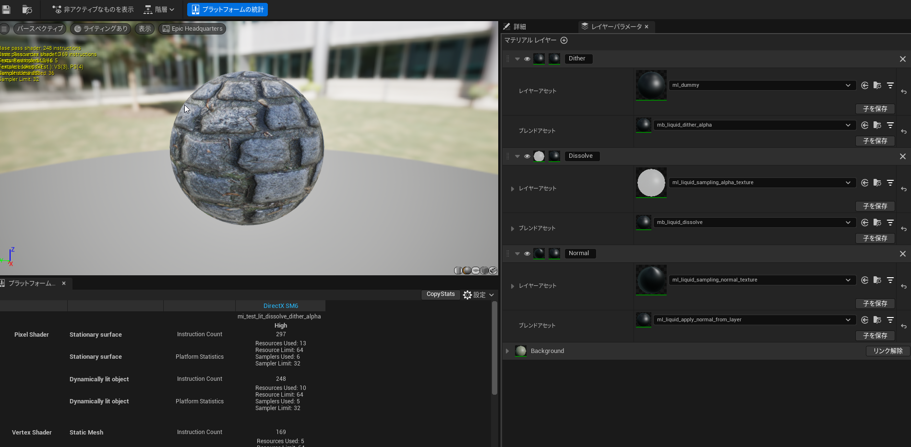
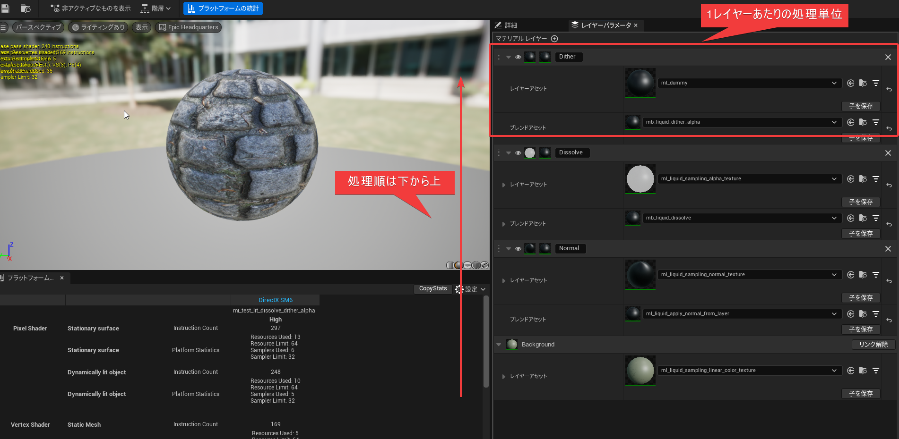
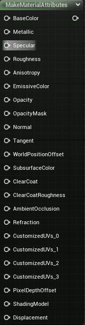
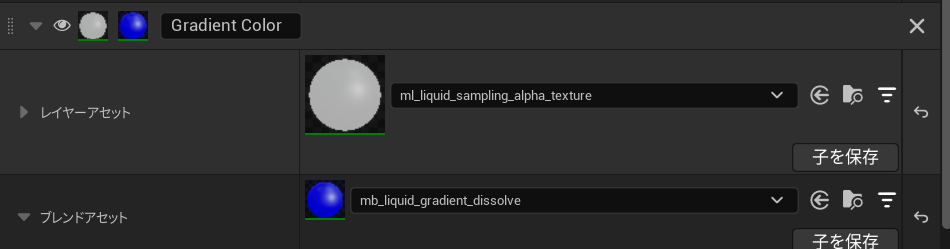
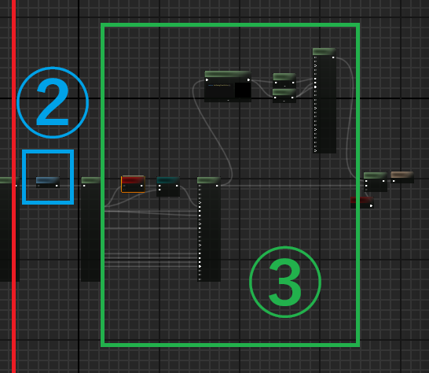

# Material Layerを使ったVFX汎用マテリアル
---
- ## Material Layerとは
- ## 作ったもの紹介
- ## 制作背景
- ## マテリアルの構造
- ## メリット/デメリット, 注意しないといけないこと
---
# Material Layersとは
- 複数の「表面（レイヤー）」を積んで、マスクでブレンドして1つのMaterialとして出力する仕組み
- 複雑な見た目（例：下地金属＋塗装＋汚れ＋傷）を 利用/調整しやすい
- Material Instance Editor 上でレイヤーの差し替えができる
- 似たような名前のLayered Materialとは別機能 (紛らわしい)
  - https://dev.epicgames.com/documentation/ja-jp/unreal-engine/layered-materials-in-unreal-engine
---
# 動画
<div style="text-align:center;">
  <video src="img/material_layer_doc.mp4" controls style="width:60%; height:auto;"></video>
</div>

---
# 作ったもの紹介
---
<div style="text-align:center;">
  <video src="img/sample_editor.mp4" controls style="width:60%; height:auto;"></video>
</div>

---
<div style="text-align:center;">
  <video src="img/sample_level.mp4" controls style="width:60%; height:auto;"></video>
</div>

---
# 実装した機能
## UV アニメーション
- Scaling,Scroll, Rotation, Shear
- Radial UV
- Random Offset
- Dynamic Parameter Scale Offset
- Distortion
- UV FlipBook
---
## マテリアルレイヤー
- Texture Sampling(sRGB, Alpha, Normal)
- Procedural Mask
    - Circle
    - Triangle
    - Quad
    - UV
    - Super Ellipse
- Scene Color Distortion
- 6 Point Light
---
## マテリアルブレンド
<!-- _class: invert two-col compact -->
<style>
section.two-col ul { columns: 2; column-gap: 1; }
</style>
- Mask
- Dissolve
- Edge Color
- Directional Dissolve
- Color Gradient(LUT)
- Alpha Gradient(LUT)
- Gradient Color Dissolve
- Texture Blend(Additive, Multiply,Subtract)
- Depth Fade
- Scaling Sprite
- Dither Alpha
- Rim Fade
- Rim Gradient(LUT)
- Fake Point Light(Ignore Collision)
- Emissive Normal
---
# 制作背景
---
## 元々はUber Materialで運用
- 機能別にStaticSwitchで分岐
- 前任者から引き継いだ時点でかなりの機能があった
---
## 最初はそれなりに順調だったけど...
- 表現を模索している段階もあり追加要望が大量にあった
  - 拡張が進むにつれ実装が大変になってきた
- 単純な機能拡張は問題ないが全体の制御フローにかかわる拡張が大変
  - マスクテクスチャの値を複数の箇所で使いたい
    - Aの機能で使用した場合はBの機能ではOFFにするといった分岐
  - LUTの適用箇所をマテリアルによって変えたい etc..
---
## 機能はまだ追加する必要があるがどうにかシンプルにできないか
- ノードグラフの整理やMaterialFunctionの切り分けは根本的な解決にならない
  - StaticSwitchによる分岐制御構造自体に限界が来ていた
  - Materialの切り分けも管理するマテリアルが増えるリスクがある
### → MaterialLayerを使うのが良さそう
---
# マテリアルの構造
---
## ノード全体


---
## 処理は大きく3つのフェーズに分かれる
1. 共通処理
2. 各レイヤー評価
3. ポスト処理



---
## 1. Base Material共通処理
- 全レイヤーが共通して使用できる値の計算を行う
  - 基本UV
  - Distortion(歪み)用UV
  - Dynamic Parameter(Niagaraから設定できる頂点Attribute)

---
## 2. 各レイヤー評価
- アーティスト側がMaterialInstance(MI)で設定する処理を実行する
- Base Material上ではこのノード一つで表現される


---
## レイヤースタック処理構造
- レイヤーの設定はMaterialInstanceEditorで行う



---
## レイヤースタック処理構造
- 設定したレイヤーは下から上の順に処理される



---
## 各レイヤーの処理準は変更可能
- Background Layerと呼ばれる特殊なレイヤーを除いて実行順は変更できる
<div style="text-align:center;">
  <video src="img/process_change.mp4" controls style="width:60%; height:auto;"></video>
</div>

---
## 各レイヤースタック間の値の受け渡し
- MaterialAttributeノードを下位スタックの出力→上位スタックの入力として受け取る
  - Unlitの場合はEmissiveColor(float3)とOpacity(float)のみなので非常にシンプル



---
## 疑似コード
###  MaterialAttribute定義
```
struct MaterialAttribute 
{
  float3 BaseColor;
  float Metallic;
  float Specular;
  float Roughness;
  float3 EmissiveColor;
  float Opacity;
    .
    .
    .

}
```
---
## レイヤースタック処理関数疑似コード
```
MaterialAttribute EvaluateLayerStack(MaterialAttribute BaseMaterialResult)
{
  MaterialAttribute BottomLayerResult = EvaluateBottomLayer(BaseMaterialResult);
  
  MaterialAttribute Layer0Result = EvaluateLayer0(BottomLayerResult);
  MaterialAttribute Layer1Result = EvaluateLayer1(Layer0Result);
  MaterialAttribute Layer2Result = EvaluateLayer2(Layer1Result);
  MaterialAttribute Layer3Result = EvaluateLayer3(Layer2Result);

  return Layer3Result;
}

```

--- 
## レイヤー内部の処理



--- 
## レイヤー内部の処理

### Material Layer
  - このレイヤーで使用したい値を用意する
    - 例:マスク処理→マスクテクスチャのサンプリングしてMaterialAttributeとして出力
### Material Layer Blend
- 下レイヤーの結果のMaterialAttributeとMaterialLayerが出力したMaterialAttributeを入力として上位レイヤーへの出力となるMaterialAttributeを作成
  - 例:マスク処理→Material Layerのテクスチャサンプル結果をOpacityに乗算して出力
#### →両方ともMaterialAttributeを入力→出力とするMaterialFunction
---
## レイヤー内部処理関数疑似コード
```
MaterialAttribute EvaluateLayer(MaterialAttribute BottomLayer)
{
  MaterialAttribute LayerResult = EvaluateLayer();
  MaterialAttribute LayerBlendResult = EvaluateLayerBlend(BottomLayer, LayerResult);

  return LayerBlendResult;
}
```
---
## 余計な処理が多そう...
- 実際にはマテリアルグラフからHLSLへの変換時に不要な変数や処理は削除された状態で展開される
  - 上記の疑似コードのような構造体や関数は使用しない
- レイヤースタックを使用することによる固有のオーバーヘッドはこの段階で最適化される
``` 
    MaterialFloat2 Local0 = Parameters.TexCoords[2].xy;
    MaterialFloat2 Local1 = CustomExpression0(Parameters,DERIV_BASE_VALUE(Local0));
    MaterialFloat2 Local2 = CustomExpression1(Parameters,
      GetDynamicParameter(Parameters.Particle,
        MaterialFloat4(1.00000000,1.00000000,0.00000000,0.00000000), 1).rgba,
        GetDynamicParameter(Parameters.Particle,
        MaterialFloat4(0.00000000,0.00000000,1.00000000,0.00000000), 2).rgba,Local1);
    MaterialFloat2 Local3 = CustomExpression2(
      Parameters,
      MaterialFloat3(Local2,1.00000000),
      MaterialFloat3(0.00000000,0.00000000,0.00000000));
    MaterialFloat Local4 = MaterialStoreTexCoordScale(Parameters, Local3, 1);
    MaterialFloat4 Local5 = ProcessMaterialColorTextureLookup(
      Texture2DSampleBias(Material.Texture2D_0,Material.Texture2D_0Sampler,Local3,View.MaterialTextureMipBias));
                                                      .
                                                      .
                                                      .

```
---
## ただし例外はある(多分)
- 使用するノードによっては処理負荷が上がりそうなものがある(最近知った)
  - BlendMaterialAttributesノードはかなり怪しい(このシステムでは未使用)
- 運用していた実装範囲ではUberMaterialと比べて処理負荷が増加するようなものは見受けられなかった
- 2つの計算結果を受けとってLerpするようなノードをレイヤーの最終評価に挟むとはおそらくHLSL出力の最適化ができない
- あくまでEditorのStat上の命令数での観測なので、正確な計測は各プラットフォームのプロファイラを使用したほうが良い
---
## 3. ポスト処理
- 最終出力前の調整処理
  - 露出補正(Eye Adaptation)
  - 単体レイヤー出力のデバッグ機能など


# メリット/デメリット, 注意しないといけないこと
---
# メリット
---
## 機能追加が圧倒的に楽になった
- 追加にかかる時間が圧倒的に減った
  - 機能によっては数日→数時間レベルに
- アセットが独立しているためユニットテストが容易
  - より自信をもって機能リリースできるように
---
## BaseMaterialがシンプルに
- ノード数が圧倒的に減った
  - StaticSwitchを使った分岐制御から解放された
- コンパイル時間が減った(気がする)
- ノード数が多いとコンパイルが失敗するUEのバグが発生しなくなった(当時)
---
## バグが少なくなった
- 機能修正がレイヤー/ブレンドアセット単位になることが多い
  - 局所的な修正を設計レベルで保障できる
- マテリアル全体が壊れにくくなった
---
# デメリット、注意しないといけないこと
---
## MI側で重いマテリアルが作成できてしまう
- その気になればテクスチャを大量にサンプリングするマテリアルや、非常に重い処理を行う機能を重ねることができる
  - MI(Material Instance)で作成できる = アーティスト環境で実現できてしまう
- 運用していたプロジェクトでレギュレーション違反するマテリアルが目立つようになった
- 実際に運用する際はレギュレーション監視ツールが必要
---
## マテリアルのバリエーションは増加しやすい
- MIで自由に処理を定義できる都合上、バリエーション自体は増加しがち
- 粒子などシンプルな構成のマテリアルはこの機能を使用しないかテンプレートを切ったほうが良い
- UDNでマテリアルレイヤー特有のバリエーション増加があるか質問している人がいるがEpicが回答せず...
---
## 同一マテリアル内の処理の使いまわしには注意が必要
- レイヤー間でテクスチャのサンプル結果や特定の計算(UV計算など)をそのまま使いまわすことはできない
  - やり方はあるが少しハック的な手法が必要
---
## Attribute Bindingが使用できない(Niagara)
- BaseMaterial側のパラメータしかBindingが使用できない
